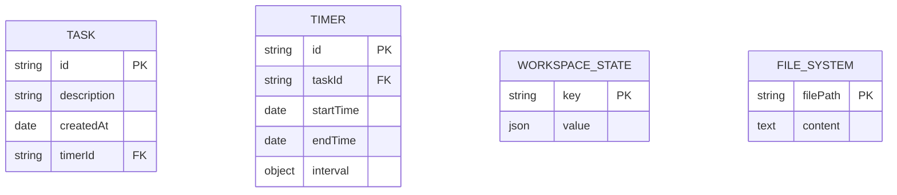

# thane VS Code Extension

Thane is a productivity focused VS Code extension that helps developers manage tasks, set timers and track progress through inline code comments. With advanced or custom use of VS Code extensions, a developer wouldn't have to leave their VS Code editor resulting in a more focussed developer experience. 


## Problem Statement

Developers often lose track of tasks while coding due to switching between multiple tools for task management.

### Solution

An integrated task management system within VS Code that allows:

- Quick task creation and completion
- Timer-based focus sessions (Pomodoro technique)
- Converting tasks to inline `// TODO` comments for context preservation
- Seamless task-to-code workflow

### Architecture Overview

```
┌─────────────────┐    ┌─────────────────┐    ┌─────────────────┐
│  VS Code APIs   │    │   Extension     │    │  User Interface │
│                 │    │   Commands      │    │                 │
│ - InputBox      │◄──►│                 │◄──►│ - Quick Pick    │
│ - QuickPick     │    │ - Add Task      │    │ - Status Bar    │
│ - StatusBar     │    │ - Timer Mgmt    │    │ - Notifications │
│ - Workspace     │    │ - Comment Mgmt  │    │                 │
└─────────────────┘    └─────────────────┘    └─────────────────┘
         │                       │                       │
         │              ┌─────────────────┐              │
         │              │ Data Management │              │
         │              │                 │              │
         └──────────────┼─ Task Manager   │──────────────┘
                        │ - CRUD Actions  │
                        │ - State Mgmt    │
                        └─────────────────┘
                               │
                    ┌─────────────────┐
                    │ Storage Layer   │
                    │                 │
                    │ - Workspace     │
                    │   State         │
                    │ - File System   │
                    │   (Comments)    │
                    └─────────────────┘

```

### Core Components

1. **TaskManager**: Handles CRUD operations for tasks
2. **CommentManager**: Manages inline code comments with unique identifiers
3. **TimerManager**: Implements Pomodoro-style focus timers with status bar integration
4. **ExtensionCommands**: Orchestrates user interactions and coordinates between managers

### Data Flow

1. User creates action → TaskManager stores in workspace state
2. User converts to comment → CommentManager inserts in active file with unique ID
3. User starts timer → TimerManager creates countdown with notification display when complete
4. User completes action → All associated comments/timers are cleaned up

## User Documentation

### Installation

### From VS Code Marketplace

1. Open VS Code
2. Go to Extensions (Ctrl+Shift+X)
3. Search "Thane"
4. Click Install

### Manual Installation

1. Download the latest `.vsix` file from releases
2. Open Command Palette (Ctrl+Shift+P)
3. Type "Extensions: Install from VSIX"
4. Select the downloaded file

### Features

### Task Management

- **Add Task**: Create new tasks quickly
- **Show Tasks**: View all current tasks
- **Complete Task**: Mark tasks as done with undo option

### Focus Timers

- **Start Timer**: Set Pomodoro-style focus sessions (1-1440 minutes)
- **Stop Timer**: Cancel active timers

### Code Integration

- **Convert to Comment**: Turn tasks into inline `// TODO` comments

### Commands

| Command | Description | Keyboard Shortcut |
| --- | --- | --- |
| `Thane: Add Action` | Create a new task | - |
| `Thane: Show Actions` | View all tasks | - |
| `Thane: Complete Action` | Mark task as complete | - |
| `Thane: Start Timer` | Begin focus session | - |
| `Thane: Stop Timer` | End active timer | - |
| `Thane: Convert to Comment` | Add task as code comment | - |
|  |  |  |

### Usage Examples

### Basic Workflow

1. **Add tasks**: `Ctrl+Shift+P` → "Thane: Add Action" → Enter "Fix login bug"
2. **Start focus session**: "Start Timer" → Select Task → Enter "25" minutes
3. **Convert to TODO**: "Convert to Comment" → Adds `// TODO: Fix login bug [created at: DATE]` to current line
4. **Complete**: "Complete Action" → Removes task once complete

### Advanced Features

- **Undo completion**: If you accidentally complete a task, click "Undo" in the notification
- **Multiple timers**: You can have different timers for different tasks
- **Persistent storage**: Tasks survive VS Code restarts
- **File integration**: Comments are tied to specific files and locations

### Configuration

Currently no configuration options are available. All settings use defaults.

### Troubleshooting

### Timer Not Showing

**Problem**: Status bar timer doesn't appear
**Solution**: Ensure you have an active timer running. Only one timer displays in status bar at a time.

### Actions Disappearing

**Problem**: Tasks disappear after closing VS Code
**Solution**: This shouldn't happen. If it does, please file a bug report.

### Known Limitations

- Only one timer can be counting at a time
- No keyboard shortcuts assigned by default
- No task prioritization or categorization
- No due dates or reminders

### Support

For bugs, feature requests, or questions:

- File an issue on [ https://github.com/jackson-07/thane]
- Include S Code version and extension version
- Provide steps to reproduce any issues

---

## Entity Relationship Diagram



### Relationships

- **Action ↔ Timer**: One-to-zero-or-one (an action can have at most one active timer)
- **Action → Workspace State**: Actions are persisted in VS Code's workspace storage
- **Comment → File System**: Comments exist as text in actual code files

### Data Storage Locations

1. **Actions**: VS Code workspace state (`workspaceState.get/update`)
2. **Comments**: Physical files as `// TODO: description`
3. **Timers**: Memory only (intervals don't persist across restarts)

---

## Future Improvements & Features

### High Priority

### **1. Keyboard Shortcuts**

```json
"keybindings": [
  { "command": "actionmanager.addAction", "key": "ctrl+alt+a" },
  { "command": "actionmanager.showActions", "key": "ctrl+alt+s" },
  { "command": "actionmanager.completeAction", "key": "ctrl+alt+c" }
]

```

### **2. Action Prioritization**

- High/Medium/Low priority levels
- Visual indicators in quick pick (🔴🟡🟢)
- Sort by priority option

### **3. Categories/Tags**

```tsx
interface Task {
  category?: string;
  tags?: string[];
}

```

### **4. Due Dates & Reminders**

- Optional due dates for actions
- Notification reminders
- Overdue task highlighting

### Medium Priority

### **5. Bulk Operations**

- Select multiple actions for completion
- "Clear all completed" command
- Import/export action lists

### **6. Timer Presets**

- Pomodoro (25min), Short Break (5min), Long Break (15min)
- Custom timer presets
- Timer templates

### Low Priority

### **7. Analytics Dashboard**

- Completed tasks per day/week
- Average focus session length
- Productivity insights

### **8. UI Improvements**

- Custom tree view for actions
- Drag-and-drop reordering
- Rich text descriptions with markdown